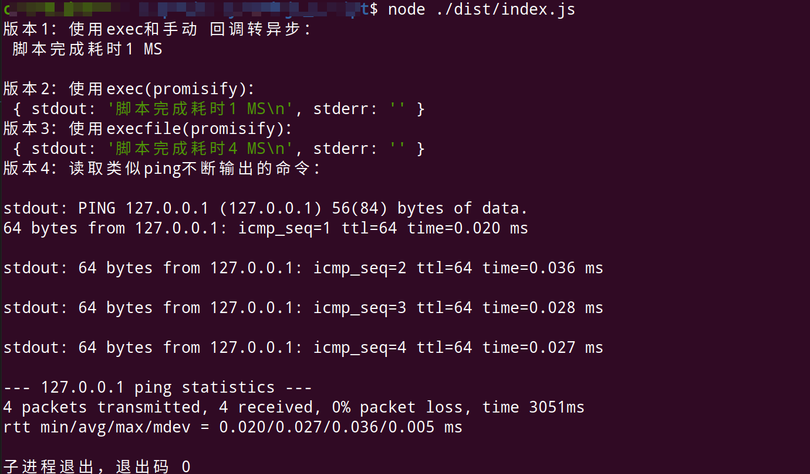

# Nodejs Script


使用Node子进程执行脚本命令。

## 方式

使用`node API`里的`exec`,`execFile`。前者执行 shell 命令，后者只能执行文件。这里是希望调用自定义脚本，所以后者更方便些。

*`exec`,`execFile`是回调形式函数，可以手动转异步，或着使用转化库`promisify`。*

## 测试

```sh
node ./dist/index.js
```

输出



## 实现

一个例子：

```ts
import { execFile } from "child_process";
import * as path from "path";
import * as util from "util";
/** 路径 */
const CWD = path.join(process.cwd(), "source");
/** 异步化 */
const exexFilePromisify = util.promisify(execFile);
/** 配置具体调用 */
const runFilePormisify = async () =>
  await exexFilePromisify("./run.sh", { cwd: CWD });
/** 使用 */
runFilePormisify()
  .then(d => console.log("[I]", d))
  .catch(e => console.log("[E]", e));
```

读取类似ping不断输出的命令，需要监听事件

```ts
/**
 * 版本4：读取类似ping不断输出的命令
 */
const readUpdateOutputPromisify = async () =>
  new Promise((resolve, reject) => {
    const ping = spawn("ping", ["127.0.0.1", "-c", "4"], {
      stdio: ["pipe", "pipe", "pipe"],
      cwd: __dirname,
      env: process.env,
      detached: true,
    });

    /** 监听输出 */
    ping.stdout.on("data", (data) => {
      /** data是buffer */
      console.log(`stdout: ${data.toString()}`);
    });

    /** 错误处理 */
    ping.stderr.on("data", (data) => {
      console.error(`stderr: ${data}`);
    });

    /** 结束处理 */
    ping.on("close", (code) => {
      console.log(`子进程退出，退出码 ${code}`);
      resolve();
    });
  });

```

## References

1. [Node.js 执行系统命令 - 掘金](https://juejin.im/post/5b07eb1c5188254e28710d80)
2. [child_process | Node.js API 文档](http://nodejs.cn/api/child_process.html#child_process_child_process_execfile_file_args_options_callback)
3. [node的process以及child_process - 掘金](https://juejin.im/post/5a996a87f265da239d48bebc)
